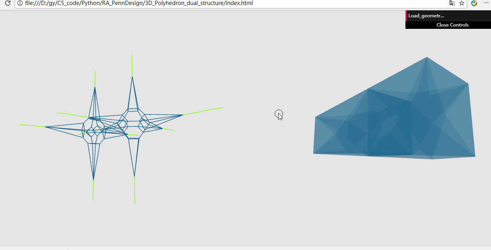
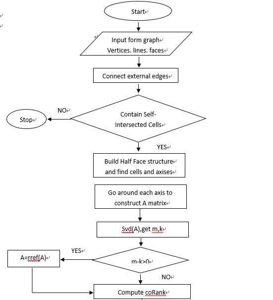
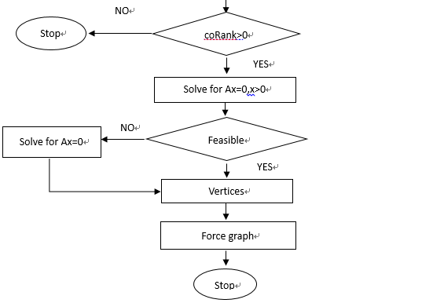

3D Polyhedron dual Structure 
======================
This is an online tool to help users to produce the dual structure of a 3D polyhedron. I developed this tool for  [Polyhedral Structures Lab of PennDesign](https://psl.design.upenn.edu/). For this project, I didn't spend much time on the visualization part. Utill now, I have finished the implementation for the core algorithm and have proved that it works. I will keep updating it and add more elements for the tool, like subdivision, more pleasing visualization, etc. Here is the demo for the tool. 

## Demo

For the video demo, click [here](https://vimeo.com/234152787).

## Description.
The solution for 3D polyhedrons is very similar to the 2D case. For the description of 2D case, click [here](https://github.com/GUOYI1/2D-Polyhedron-dual_structure). There 3 main difference compared to the 2D case. The first is that we extend the halfedge data structure to halfFace data structure to store the topology of 3D polyhedron. The second is that the corresponding relationships change a little. Different from the 2D case, in 3D case, each edge in the dual structure is perpendicular to one of the faces in the original graph and each vertex corresponds with one of the cells instead of one of the faces. The third is that, since the corresponding relationships change, to construct the matrix equation, we need to go around each "axis"(internal edge) in the original graph instead of each node.

## Data structure
For the halfFace data structure, basically speaking, each halfFace belongs to a cell. The normals of all the halfFaces in a single cell point to the inside of the cell.  For each halfFace, it stores the member of `sym face`, which points to the twin halfFace that has the opposite normal direction, and the member of `cell`, which points to cell it belongs to. Also, it stores a group of `adjacent faces` that are connected to it and belong to the same cell. For each halfedge, besides the members of `next`,`sym` and `vert`, it also stores a group of halfFaces that are connected to it.

## Algorithm and flow chart.
The algorithm for the 3D case is similar to the 2D case. The only difference is that we need to go around each axis instead of each node to construct the matrix equation. The overall process can be described as the flow chart below.

For any question or suggestions, please feel free to contact me.